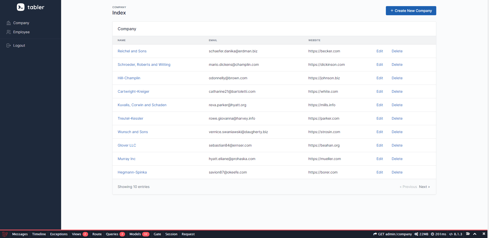
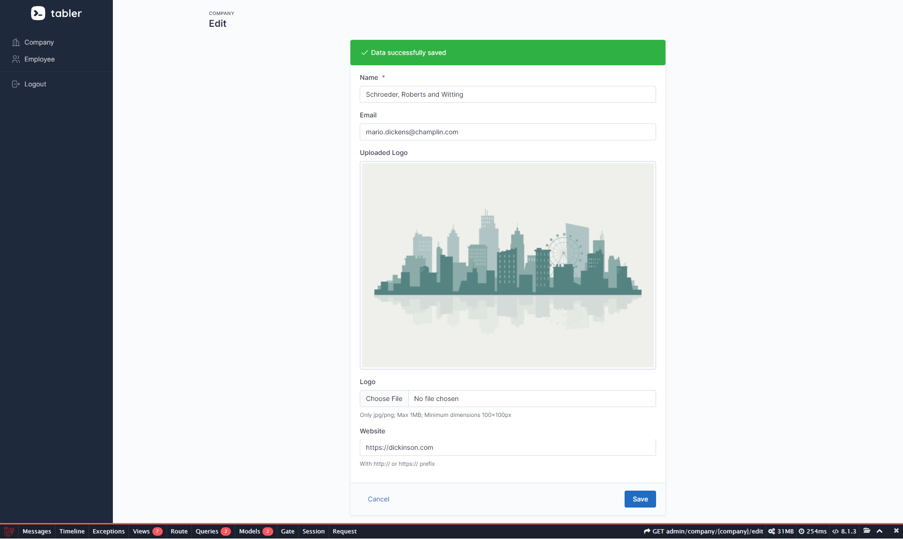
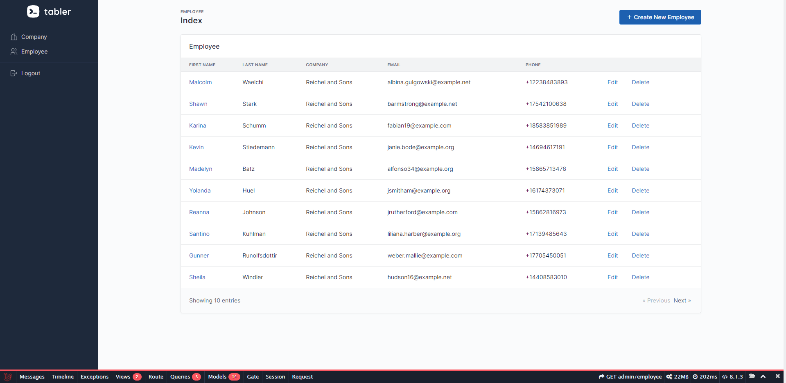
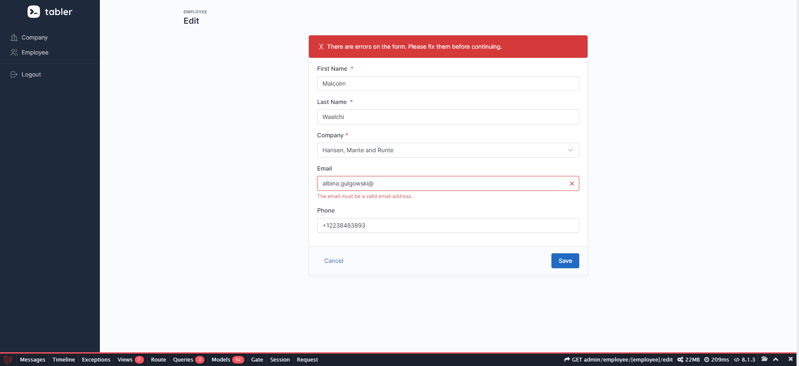
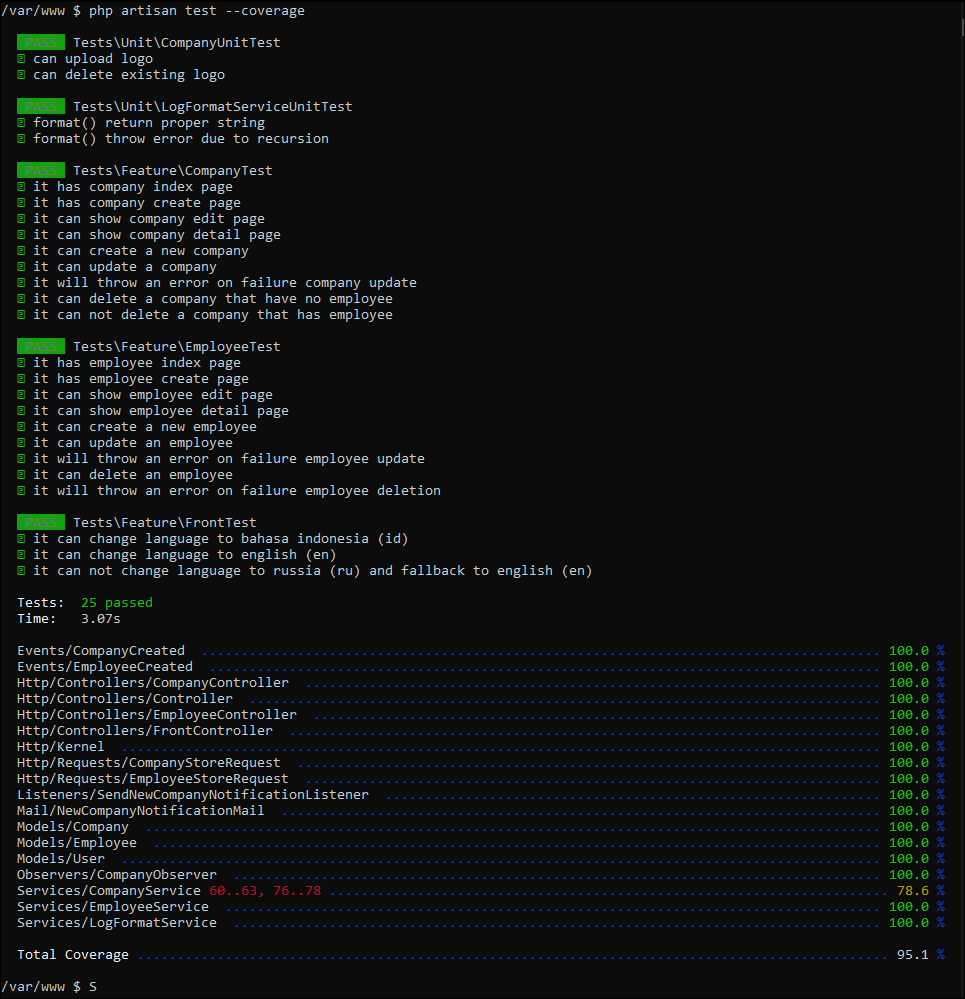
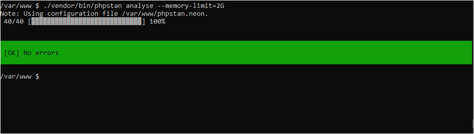

## About

Laravel Daily Manage Companies  
https://laraveldaily.com/test-junior-laravel-developer-sample-project/

## Tasks

### Basic

* Basic Laravel Auth: ability to log in as administrator
    * **DONE**
* Use database seeds to create first user with email admin@admin.com and password “password”
    * **DONE**
* CRUD functionality (Create / Read / Update / Delete) for two menu items: Companies and Employees.
    * **DONE**
* Companies DB table consists of these fields: Name (required), email, logo (minimum 100×100), website
    * **DONE**
* Employees DB table consists of these fields: First name (required), last name (required), Company (foreign key to
  Companies), email, phone
    * **DONE**
* Use database migrations to create those schemas above
    * **DONE**
* Store companies logos in storage/app/public folder and make them accessible from public
    * **DONE**
    * File uploaded to S3 (minio) with public access.
* Use basic Laravel resource controllers with default methods – index, create, store etc.
    * **DONE**
* Use Laravel’s validation function, using Request classes
    * **DONE**
* Use Laravel’s pagination for showing Companies/Employees list, 10 entries per page
    * **DONE**
    * Utilize Laravel Cursor Pagination
* Use Laravel make:auth as default Bootstrap-based design theme, but remove ability to register
    * **DONE**
    * Utilize laravel/ui as make:auth replacement.

### Advanced

* Use Datatables.net library to show table – with our without server-side rendering
    * **SKIP**
    * Utilize Laravel Cursor Pagination.
* Use more complicated front-end theme like AdminLTE
    * **DONE**
    * Utilize [Tabler.io](https://tabler.io/)
* Email notification: send email whenever new company is entered (use Mailgun or Mailtrap)
    * **DONE**
    * Utilize Laravel Event & Queue.
* Make the project multi-language (using **resources/lang** folder)
    * **DONE**
    * EN & ID available to choose.
* Basic testing with phpunit
    * **DONE**
    * With coverage report.

### Additional

* Docker.
    * nginx
    * php 8.1-fpm
    * mariadb
    * redis
    * minio (object storage)
    * mailhog (email testing)
    * xdebug 3
    * ray/buggregator (debug server)
* Error logging.
* Laravel Blade Components.
* Laravel Eloquent Accessor.
* Laravel Event & Listener.
* Laravel Model Factory.
* Laravel Queue.
* Static code analysis (larastan)
* Testing with Xdebug & coverage report.


## Run
```
git clone
cp .env.docker.example .env
docker-compose up
docker exec -it app composer install
docker exec -it app php artisan key:generate
docker exec -it app php artisan migrate --seed
# open http://localhost:8001/
```

## Test
```
# Integration test
docker exec -it app php artisan test

# Larastan 
docker exec -it app ./vendor/bin/phpstan analyse --memory-limit=2G
```

## Logins

* app
    * http://localhost:8001/
    * admin@admin.com:password
* mailhog
    * http://localhost:8026/
* mariadb console
    * root:
* minio console
    * http://localhost:9011/
    * minioadmin:minioadmin
* ray
    * http://127.0.0.1:23517/
* redis
    * http://localhost:6380/

## Screenshots











